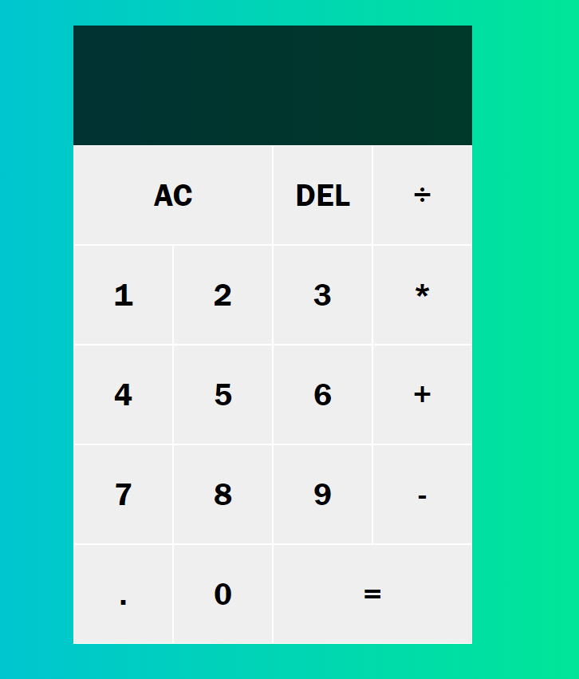

# JavaScript Calculator 

## Built to practice BootStrap

## Deployed Site 
https://mibrahim234.github.io/Nature-BootStrap-Project/

## Description 
Nature Project is an app made to practice bootstrap. The app is responsive and contains beautiful images of nature. Enjoy the pictures that were from unsplash.com.
  

## Table of Contents
* [Installation](#installation)
* [Usage](#usage)
* [Technologies](#technologies)
* [Credit](#credit)
* [License](#license)
* [Questions](#questions)
* [Website](#website)
* [Contribution](#contribution)

## Installation
In order to install this project, you must login to GitHub and go to https://github.com/mibrahim234/Nature-BootStrap-Project. Once there you will click on the green button that says clone or download. You will be given choices on how to download: using the ssh/html key or downloading the zip file.

Using SSH/HTML Key: You will copy the link shown and open up either terminal (mac: pre-installed) or gitbash (pc: must be installed). Once the application is open, you will type git clone paste url here. Once you have cloned the git team-generator repo, cd into the repo and type "open . for mac" Or "code . for windows" to open the folder which contains all files used for the website.

Using Download ZIP: Click on Download Zip. Locate the file and double click it to unzip the file. Locate the unzipped folder and and open it. All the files for the website will be within this folder. 

---

## Usage 

- To use the application locally, go to the html file, right click & open in default browser to initialize the app. 
---

## Technologies
- [BootStrap](https://getbootstrap.com/)
- [JQuery](https://jquery.com/)
- [GitHub](https://github.com/)

## Credit
Credit to Colt Steele On Udemy for going over bootstrap and doing a step by step on his Candy Project.

## License
Copyright (c) [2022]
The license is MIT License. 
Read more about it at https://opensource.org/licenses/MIT.

## Questions
- Please reach out through github or by email. 

- [mibrahim234](https://github.com/mibrahim234) 

- mohamm1417@gmail.com

## Website
[Link to the GIT repository](https://github.com/mibrahim234/Nature-BootStrap-Project)

## Contribution
Made with ❤️ by Mohammad Ibrahim 